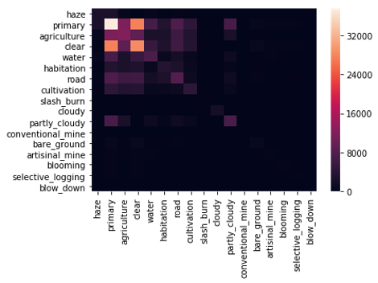

 # Amazon Rainforest Deforestation Project

### Understanding the effects of human activity using satellite imagery
#### Executive Summary
This team project is part of the Booz Allen Hamilton sponsored Women in Data Science Incubator.  We are using data from a <a href="https://www.kaggle.com/c/planet-understanding-the-amazon-from-space/overview">Kaggle competition</a> to create a multi-label classification model. Given the imbalanced classes, we use the f2 score to weigh more heavily on recall than precision. XGBoost improves the baseline from 0.36 score with logistic regression and brings the score up to 0.41. We are developing a Dash web app to create an interactive dashboard that plots the predicitions of the trained model.

#### The Data
With this this dataset, we have over 40,000 jpeg files with pixel values set at 256x256. These images contain class labels based on atmospheric conditions, land cover, or land use. Major takeaways include the class imbalance found in the labels, as this dataset contains minimal deforestation data. The heat map below demonstrates these biases. Take a look at the “Clear” or “Primary” label (refers to forest coverage) examples for instance. 

#### The Model
For our approach with the model, we independently train a binary classifier for each label to account for the multiple labels attributed to a single image. We start out by training the data by first converting the jpeg fils into numpy arrays, by using the “r”, “g”, “b” pixel values. Then, we develop features for each of the values by using max value, mean, and standard deviation of “r”, “g”, and “b”. This recognizes that for any given image, there can be multiple labels or attributes associated with it. An image could have multiple attributed labels, “primary”, “clear”, and “selective logging” for example. We label each image with all classifiers that predict ‘1’. After these preliminary steps, for our model, we use logistic regression creates a baseline for performance of the model. From there, we use XGBoost to improve our baseline from 0.36 score with logistic regression and brought the score up to 0.41. Through this process and given the imbalanced classes, we decide to base the strength of the model on the f2 score. By using the f2 score, we weigh more heavily on recall than precision, especially since the labels of deforestation have very few positive examples and many negative examples.

#### The Dash App
To operationalize this data and take a step beyond creating predictive models, during the course of the WiDS challenge, we put together an initial interactive tool that allows the user to review images, image labels, and map the images to the lat/long coordinates on an interactive Plotly map through Dash. Take a look at our proof of concept in the GUI under the app folder. 

For future iterations of the project, we plan to encode an option for users to upload batch image files and compute predictions on image labels. These geotagged images then will map back to a Plotly map with an interactive tooltip that will project not only the coordinates but also the class labels. The idea is for each selected point to have a corresponding filter within the adjacent table. For the moment the data table serves as a reference. Users are able to filter through the rows based on specified text.
